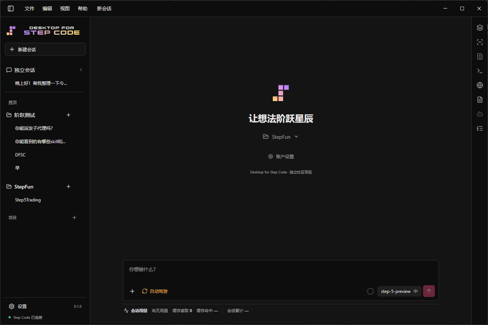

<p align="center">
  
</p>
<br>
<p align="center">
  
</p>
<hr>
<p align="center">Let ideas reach the stars.</p>
<p align="center">Windows x64 · Electron · React · TypeScript · MIT</p>
<p align="center"><a href="README.md">English</a> · <a href="README.zh-CN.md">简体中文</a></p>
<p align="center">
  
</p>

A Windows desktop client for [Step Code](https://github.com/stepfun-ai/Step-Code). It provides desktop workspaces, conversations, and session management; Step Code powers agent execution.

### Why This Project

The original idea was to explore a community-built desktop client for Step Code while no official Step Code desktop app has been released. Given my love for StepFun, I also look forward to its official release.

### Features

- Streaming conversations, model and thinking-level selection
- Independent sessions and project workspaces, ordering, pinning, archiving and branching
- Concurrent sessions, queued sends, steering, quotes and cross-session links
- Image attachments, tool approvals, subagent status and elapsed-time feedback
- Summary, context and diff inspection, with bounded recorded-change undo
- A terminal, user-operated browser, file previews and delivery references
- Step account sign-in, MCP configuration, and resource discovery
- Chinese and English UI, with light and dark themes
- GitHub update checks and notifications, with selectable release channels
- Background tray operation and window restoration
- Font and size settings for the interface, messages, code and Diff, plus message line spacing

The app keeps its data in a dedicated directory (`%APPDATA%\Desktop for Step Code`) instead of reusing a personal Step Code CLI profile. Step Code owns agent execution and permission policies; Desktop adds session orchestration and desktop interactions. Concurrent collaboration does not provide file locks or transaction isolation.

Step login credentials are encrypted for the current Windows user in `step-runtime/auth.dpapi`. Existing desktop `auth.json` data is migrated on startup, and the plaintext file is removed after the encrypted copy is saved. Uninstall removes the desktop Step credential files while keeping sessions, settings and independent workspace files; signing out removes the Step credential as well. This protects against casual offline reading of the file, not software running with access to the same Windows account. Other configured MCP secrets are outside this credential migration.

If the app fails to start or the Step Code runtime exits unexpectedly, a `crash-<timestamp>-<id>.log` is written to `%APPDATA%\Desktop for Step Code\logs\` with the app version, the startup phase, and the error. That data lives under `%APPDATA%` rather than the install directory, so reinstalling does not clear it; read the newest crash log before reinstalling.

The built-in StepPage MCP server cannot start on Windows: the command the upstream registers is a shell wrapper, which Windows cannot spawn directly, and the official installer is a shell script as well, which the upstream code explicitly skips on Windows. When the desktop app detects the official bundle under `%USERPROFILE%\.steppage-mcp\bin\`, it registers a working server on your behalf, with the command pointing at the bundled Node runtime and the argument at that bundle; authentication reuses your Step sign-in, so no extra key is needed. Publishing to StepPage has not been acceptance-tested.

### Download and Run

The latest Windows x64 community preview, **v0.2.0**, is available, adding update notifications, a background tray and reading typography settings.

**[Download the Windows x64 installer](https://github.com/7oMB2006/desktop-for-step-code/releases/download/v0.2.0/Desktop.for.Step.Code.Setup.0.2.0.exe)** · [Release notes and checksums](https://github.com/7oMB2006/desktop-for-step-code/releases/tag/v0.2.0) · [All releases](https://github.com/7oMB2006/desktop-for-step-code/releases)

1. Download the installer, verify its SHA-256 against the release notes, and run it.
2. Launch the app and sign in under Account Settings with your own Step Plan account or Step Platform API key.
3. Open a local project or choose an independent session, select a model, and start a conversation.

The installer includes Electron and pinned Step Code and Node runtimes; the development dependencies below are not required. Git/Bash, project-specific tools, and MCP server dependencies must be installed separately. Model access and usage limits depend on your account.

**Installation notice:** The v0.2.0 installer is unsigned. Windows may display SmartScreen or an "unknown publisher" warning. Verify the download source and checksum; do not disable system security protections.

**Updates:** v0.2.0 checks for updates after startup and every six hours. You can also check manually or disable automatic checks under Settings → Updates. The default channel includes releases and previews; the releases-only channel excludes community previews. Downloads open in your system browser, and you run installers yourself; the app does not silently install updates or restart automatically. v0.1.0 users must download this upgrade manually from [Releases](https://github.com/7oMB2006/desktop-for-step-code/releases).

**Exit and upgrade:** Closing the window keeps the app in the tray and lets running tasks continue. Before upgrading, finish tasks and explicitly quit through File → Exit App or the tray menu, then run the installer over the existing installation.

This release targets Windows x64, with no compatibility commitment for macOS, Linux, or WSL. To run from source, follow the build instructions below.

### Build from Source

Requirements: Windows x64, Git, Node.js 24.15.0 (or a compatible Node.js version `>=22.19`), and Corepack. Before building, fetch the pinned Step Code upstream revision in the repository root and apply the Windows/Desktop integration patch maintained here.

Run these commands in PowerShell from the repository root:

```powershell
git clone https://github.com/stepfun-ai/Step-Code.git Step-Code
git -C Step-Code checkout f7392089e67d80232b73c87f894dec8100c6c20a
node scripts/apply-step-code-desktop-patch.mjs ..\Step-Code patches\step-code-desktop.patch

Push-Location Step-Code
corepack pnpm install --frozen-lockfile
corepack pnpm build
Pop-Location

Push-Location Desktop
corepack pnpm install --frozen-lockfile
node node_modules/electron/install.js
corepack pnpm stage:runtime
corepack pnpm typecheck
corepack pnpm test
corepack pnpm build
node scripts/verify-electron.mjs
corepack pnpm dev
```

To produce a Windows x64 installer:

```powershell
corepack pnpm package
node scripts/checksums.mjs
```

### Project Status

See the [Development TODO](TODO.md) (Chinese) for planned work and priorities.

v0.2.0 remains a community preview, not an official StepFun product or a stability guarantee. First-release preparation included testing on one Windows Server 2022 cloud desktop: real-account conversations, tool edits and approvals, artifact opening, restart recovery, installation, installation over an existing build, uninstall, and reinstall. A cloud-desktop upgrade to the v0.2.0 RC was also confirmed by the user. This does not establish coverage of every Windows 10/11 configuration, model, or MCP scenario.

See [VERIFICATION.md](docs/VERIFICATION.md) and the [release preparation record](docs/RELEASE.md) (Chinese) for the evidence and scope. The Summary board shows MCP connection states supplied by the runtime; enabled configuration alone is not a health check, and connection status does not establish successful service calls.

### License

Desktop for Step Code is licensed under MIT. Step Code and its Pi upstream components retain their respective licenses and notices.
