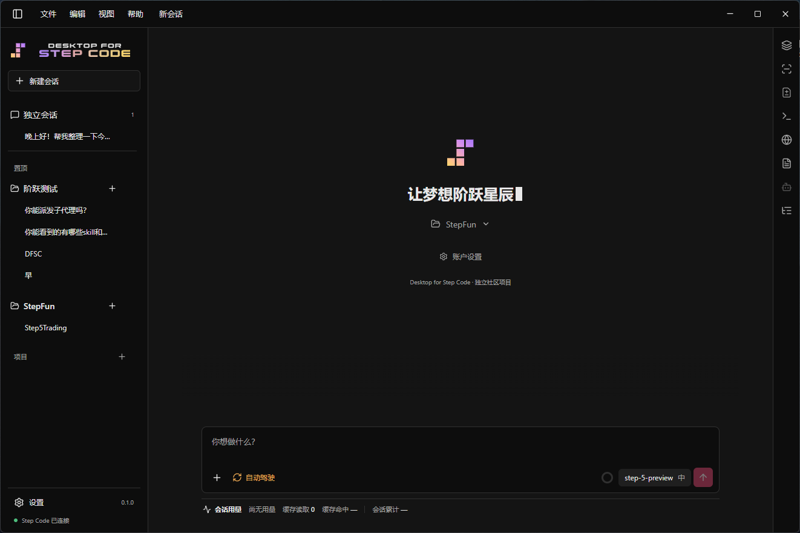

<p align="center">
  
</p>
<br>
<p align="center">
  
</p>
<hr>
<p align="center">让想法阶跃星辰。</p>
<p align="center">Windows x64 · Electron · React · TypeScript · MIT</p>
<p align="center"><a href="README.md">English</a> · <a href="README.zh-CN.md">简体中文</a></p>
<p align="center">
  
</p>

一个面向 Windows 的 [Step Code](https://github.com/stepfun-ai/Step-Code) 桌面客户端。它提供桌面工作区、对话和会话管理，Agent 执行由 Step Code 提供。

### 项目初衷

项目最初的想法，是在 StepFun 官方尚未正式推出 Step Code Desktop 的窗口期，尝试开发一个社区版 Desktop；鉴于我对阶跃星辰的喜爱，我也期待 StepFun 早日发布官方版本！

### 功能

- 流式对话、模型与思考等级选择
- 独立会话和项目工作区，排序、置顶、归档与会话分支
- 并发会话、排队与插队引导、文本引用和跨会话链接
- 图片附件、工具调用确认、子代理状态和耗时反馈
- 摘要、上下文与 Diff 检查，记录改动的有限撤销
- 内置终端、用户操作的浏览器、文件预览与交付产物引用
- Step 账户登录、MCP 配置与资源发现
- 中英文界面和明暗主题

桌面端使用单独的应用数据目录（`%APPDATA%\Desktop for Step Code`），不复用个人 Step Code CLI 配置。Step Code 提供 Agent 执行与权限策略，Desktop 提供会话编排和桌面交互；并发协作不等于文件锁或事务隔离。

Step 登录凭据使用当前 Windows 用户的加密存储机制保存到 `step-runtime/auth.dpapi`。已有桌面端 `auth.json` 会在启动时迁移并移除明文文件；卸载会清除桌面端 Step 凭据，但保留会话、设置和独立工作区文件，退出登录也会清除 Step 凭据。这不能防护同一 Windows 用户身份下运行的其他软件；MCP 配置中的密钥不属于这次迁移范围。

内置的 StepPage MCP 服务在 Windows 上不可用：上游注册的 command 是一个 shell 包装，Windows 无法直接启动它；官方安装途径同样是 shell 脚本，上游代码在 Windows 上也明写跳过自动安装。桌面端探测到 `%USERPROFILE%\.steppage-mcp\bin\` 下的官方 bundle 时会自动注册一个可用的配置，command 指向随包暂存的 Node 运行时，args 指向该 bundle，认证沿用 Step 登录，无需额外配置 key。向 StepPage 实际发布未验收。

若应用启动失败或 Step Code 运行时意外退出，日志会写入 `%APPDATA%\Desktop for Step Code\logs\crash-<timestamp>-<id>.log`。日志位于应用数据目录，重装不会清除；排查时先查看最新日志。

### 下载与运行

当前仓库提供源码，GitHub Releases 暂无公开安装包。安装包和发布时间将在完成发布验收后另行确定；本机生成的安装文件不包含在仓库中。

首版正在整理为 Windows x64 社区预览版，发布门槛与当前进度见 [首版发布准备](docs/RELEASE.md)。

从源码运行需要 Windows x64 环境和下方列出的构建依赖。首次启动后，在账户设置中使用自己的 Step Plan 账户或 Step Platform API Key 登录，再打开本地项目。Git/Bash、项目专用命令行工具以及 MCP 服务端依赖需在主机上另行安装。

### 从源码构建

需要 Windows x64、Git、Node.js 24.15.0（或兼容的 Node.js `>=22.19`）和 Corepack。构建前需在仓库根目录获取固定版本的 Step Code 上游代码，并应用本仓库维护的 Windows/Desktop 集成补丁。

在仓库根目录的 PowerShell 中运行：

```powershell
git clone https://github.com/stepfun-ai/Step-Code.git Step-Code
git -C Step-Code checkout 519e4de4ed2162d3667be1821cb92ada6b884e5a
git -C Step-Code apply ../patches/step-code-desktop.patch

Push-Location Step-Code
corepack pnpm install --frozen-lockfile
corepack pnpm build
Pop-Location

Push-Location Desktop
corepack pnpm install --frozen-lockfile
node node_modules/electron/install.js
corepack pnpm stage:runtime
corepack pnpm typecheck
corepack pnpm test
corepack pnpm build
node scripts/verify-electron.mjs
corepack pnpm dev
```

生成 Windows x64 安装程序：

```powershell
corepack pnpm package
node scripts/checksums.mjs
```

### 当前状态

这是社区预览版，完整的公开发布验收仍在进行。一次性 Windows 虚拟机验证了历史候选包的安装、凭据迁移和卸载；另一次真实 Step Plan 账号验收中，打包客户端使用 `step-5-preview` 完成了一项编程任务及桌面端工具审批。这些历史结果不代表最新安装器已经通过完整验收。具体验收记录与发布范围见 [VERIFICATION.md](docs/VERIFICATION.md)。摘要板展示运行时实际提供的 MCP 连接状态；配置启用不等于连接健康，也不代表实际业务调用成功。

### 许可

Desktop for Step Code 源码采用 MIT 许可证。Step Code 及其 Pi 上游组件保留各自许可证和版权声明。
